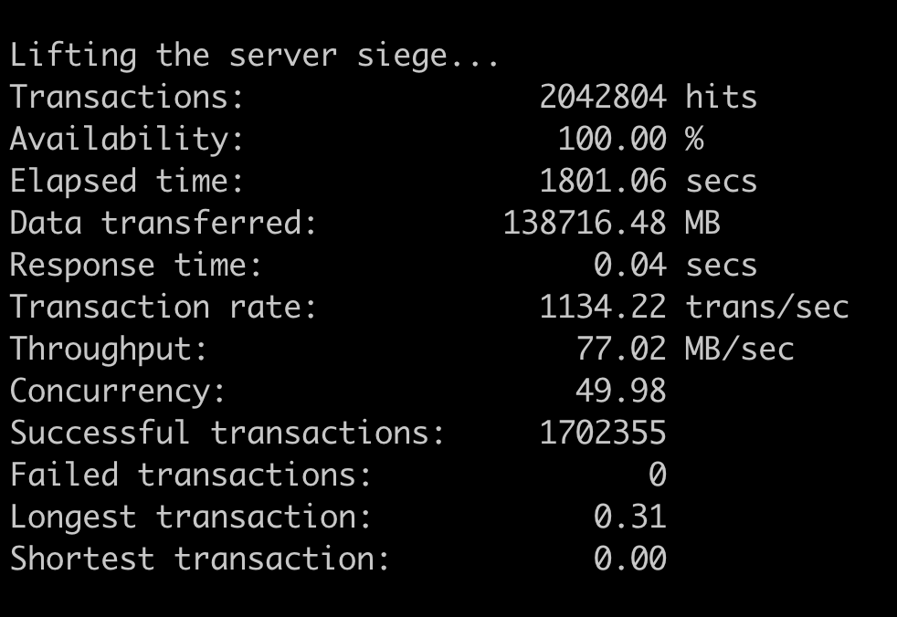

## 🌐 Webserv


#### My little web server

## 🤝 Introduction

- A single-threaded asynchronous web server implemented in C++ 98.

## 🧩 Functions

```
- Implemented using C++, CGI, Kernel Queue, POSIX, HTML, and CSS.
- Enhanced maintainability and scalability using object-oriented programming (interface structure).
- Implemented external dependencies like Config and types using the Singleton Pattern.
- Made server-side advanced tasks easier with CGI functionality.
- Implemented HTTP 1.1 protocol.
- Developed GET, POST, DELETE, PUT, HEAD methods compliant with the protocol.
- Handled client requests asynchronously.
- Implemented the default (index.html) webpage.
- Created error pages.
```

## 📸 Screenshots

| GET | POST | DELETE | PUT | Siege Test |
| --- | --- | --- | --- | --- |
|  |  |  |  |  |

## 🛠 Development Environment


-blue.svg)

## ⚙️ Tools

```
1. Github (Issue and configuration management)
2. Notion (Communication)
3. Slack (Communication)
4. VSCode (Development)
```

## ✨ Skills & Tech Stack

```
- C++98
- POSIX
- CGI
- Kernel Queue
- HTML
- CSS
```

## 🔀 GIT

1. [Commit Conventions](https://github.com/MyLittleWebServer/webserv/discussions/3)
   - `feat`: Adding a new feature to the application or library.
   - `fix`: Fixing a bug.
   - `build`: Changes that affect the build system or external dependencies (e.g., gulp, broccoli, npm).
   - `ci`: Changes to CI configuration files and scripts (e.g., Travis, Circle, BrowserStack, SauceLabs).
   - `chore`: Other changes that don't modify source code.
   - `docs`: Documentation changes only.
   - `perf`: Code changes that improve performance.
   - `refactor`: Code changes that neither fix a bug nor add a feature.
   - `revert`: Reverting a previous commit.
   - `style`: Changes that do not affect the meaning of the code (white space, formatting, missing semicolons, etc.).
   - `test`: Adding or updating tests.
   - `wip`: Work in progress.

2. Git Branches
   - `main`: Deployment
   - `develop`: Branch for merging developed features.
   - `#[Tracker ID] [Commit Convention Name] / [Function Name]`: Branch for developing each feature.

## 🗂 Directory Structure

```
📦srcs
 ┣ 📂clients
 ┃ ┣ 📂candidate_fields
 ┃ ┃ ┣ 📂include
 ┃ ┃ ┃ ┣ 📜CandidateFields.hpp
 ┃ ┃ ┃ ┗ 📜ICandidateFields.hpp
 ┃ ┃ ┗ 📂srcs
 ┃ ┃ ┃ ┗ 📜CandidateFields.cpp
 ┃ ┣ 📂cgi
 ┃ ┃ ┣ 📂include
 ┃ ┃ ┃ ┣ 📜CGI.hpp
 ┃ ┃ ┃ ┗ 📜ICGI.hpp
 ┃ ┃ ┗ 📂src
 ┃ ┃ ┃ ┗ 📜CGI.cpp
 ┃ ┣ 📂client
 ┃ ┃ ┣ 📂include
 ┃ ┃ ┃ ┗ 📜Client.hpp
 ┃ ┃ ┗ 📂src
 ┃ ┃ ┃ ┗ 📜Client.cpp
 ┃ ┣ 📂method
 ┃ ┃ ┣ 📂include
 ┃ ┃ ┃ ┣ 📜DELETE.hpp
 ┃ ┃ ┃ ┣ 📜DummyMethod.hpp
 ┃ ┃ ┃ ┣ 📜GET.hpp
 ┃ ┃ ┃ ┣ 📜IMethod.hpp
 ┃ ┃ ┃ ┗ 📜POST.hpp
 ┃ ┃ ┗ 📂src
 ┃ ┃ ┃ ┣ 📜DELETE.cpp
 ┃ ┃ ┃ ┣ 📜DummyMethod.cpp
 ┃ ┃ ┃ ┣ 📜GET.cpp
 ┃ ┃ ┃ ┗ 📜POST.cpp
 ┃ ┣ 📂request
 ┃ ┃ ┣ 📂include
 ┃ ┃ ┃ ┣ 📜IRequest.hpp
 ┃ ┃ ┃ ┗ 📜Request.hpp
 ┃ ┃ ┣ 📂request_parser
 ┃ ┃ ┃ ┣ 📂include
 ┃ ┃ ┃ ┃ ┣ 📜IRequestParser.hpp
 ┃ ┃ ┃ ┃ ┗ 📜RequestParser.hpp
 ┃ ┃ ┃ ┗ 📂src
 ┃ ┃ ┃ ┃ ┗ 📜RequestParser.cpp
 ┃ ┃ ┗ 📂src
 ┃ ┃ ┃ ┗ 📜Request.cpp
 ┃ ┣ 📂response
 ┃ ┃ ┣ 📂include
 ┃ ┃ ┃ ┣ 📜IResponse.hpp
 ┃ ┃ ┃ ┗ 📜Response.hpp
 ┃ ┃ ┗ 📂src
 ┃ ┃ ┃ ┗ 📜Response.cpp
 ┃ ┗ 📜.DS_Store
 ┣ 📂config
 ┃ ┣ 📂child_config
 ┃ ┃ ┣ 📂include
 ┃ ┃ ┃ ┗ 📜IChildConfig.hpp
 ┃ ┃ ┣ 📂location_config
 ┃ ┃ ┃ ┣ 📂include
 ┃ ┃ ┃ ┃ ┣ 📜ILocationConfig.hpp
 ┃ ┃ ┃ ┃ ┗ 📜LocationConfig.hpp
 ┃ ┃ ┃ ┗ 📂src
 ┃ ┃ ┃ ┃ ┗ 📜LocationConfig.cpp
 ┃ ┃ ┣ 📂mime_types_config
 ┃ ┃ ┃ ┣ 📂include
 ┃ ┃ ┃ ┃ ┣ 📜IMimeTypesConfig.hpp
 ┃ ┃ ┃ ┃ ┗ 📜MimeTypesConfig.hpp
 ┃ ┃ ┃ ┗ 📂src
 ┃ ┃ ┃ ┃ ┗ 📜MimeTypesConfig.cpp
 ┃ ┃ ┣ 📂proxy_config
 ┃ ┃ ┃ ┣ 📂include
 ┃ ┃ ┃ ┃ ┣ 📜IProxyConfig.hpp
 ┃ ┃ ┃ ┃ ┗ 📜ProxyConfig.hpp
 ┃ ┃ ┃ ┗ 📂src
 ┃ ┃ ┃ ┃ ┗ 📜ProxyConfig.cpp
 ┃ ┃ ┣ 📂root_config
 ┃ ┃ ┃ ┣ 📂include
 ┃ ┃ ┃ ┃ ┣ 📜IRootConfig.hpp
 ┃ ┃ ┃ ┃ ┗ 📜RootConfig.hpp
 ┃ ┃ ┃ ┗ 📂src
 ┃ ┃ ┃ ┃ ┗ 📜RootConfig.cpp
 ┃ ┃ ┗ 📂server_config
 ┃ ┃ ┃ ┣ 📂include
 ┃ ┃ ┃ ┃ ┣ 📜IServerConfig.hpp
 ┃ ┃ ┃ ┃ ┗ 📜ServerConfig.hpp
 ┃ ┃ ┃ ┗ 📂src
 ┃ ┃ ┃ ┃ ┗ 📜ServerConfig.cpp
 ┃ ┣ 📂include
 ┃ ┃ ┣ 📜Config.hpp
 ┃ ┃ ┗ 📜IConfig.hpp
 ┃ ┣ 📂parser
 ┃ ┃ ┣ 📂include
 ┃ ┃ ┃ ┣ 📜ConfigParser.hpp
 ┃ ┃ ┃ ┗ 📜IConfigParser.hpp
 ┃ ┃ ┗ 📂src
 ┃ ┃ ┃ ┗ 📜ConfigParser.cpp
 ┃ ┗ 📂src
 ┃ ┃ ┗ 📜Config.cpp
 ┣ 📂exception
 ┃ ┣ 📂include
 ┃ ┃ ┣ 📜ExceptionThrower.hpp
 ┃ ┃ ┗ 📜errorMessage.hpp
 ┃ ┗ 📂src
 ┃ ┃ ┗ 📜ExceptionThrower.cpp
 ┣ 📂server
 ┃ ┣ 📂include
 ┃ ┃ ┣ 📜EventHandler.hpp
 ┃ ┃ ┣ 📜Kqueue.hpp
 ┃ ┃ ┣ 📜Server.hpp
 ┃ ┃ ┗ 📜ServerManager.hpp
 ┃ ┗ 📂src
 ┃ ┃ ┣ 📜EventHandler.cpp
 ┃ ┃ ┣ 📜Kqueue.cpp
 ┃ ┃ ┣ 📜Server.cpp
 ┃ ┃ ┗ 📜ServerManager.cpp
 ┣ 📂utils
 ┃ ┣ 📂checker
 ┃ ┃ ┣ 📂include
 ┃ ┃ ┃ ┣ 📜FileChecker.hpp
 ┃ ┃ ┃ ┣ 📜IChecker.hpp
 ┃ ┃ ┃ ┗ 📜IFileChecker.hpp
 ┃ ┃ ┗ 📂src
 ┃ ┃ ┃ ┗ 📜FileChecker.cpp
 ┃ ┣ 📂reader
 ┃ ┃ ┣ 📂include
 ┃ ┃ ┃ ┣ 📜IReader.hpp
 ┃ ┃ ┃ ┗ 📜Reader.hpp
 ┃ ┃ ┗ 📂src
 ┃ ┃ ┃ ┗ 📜Reader.cpp
 ┃ ┗ 📂util
 ┃ ┃ ┣ 📂include
 ┃ ┃ ┃ ┣ 📜Color.hpp
 ┃ ┃ ┃ ┣ 📜Status.hpp
 ┃ ┃ ┃ ┣ 📜Utils.hpp
 ┃ ┃ ┃ ┗ 📜Utils.tpp
 ┃ ┃ ┗ 📂src
 ┃ ┃ ┃ ┣ 📜Status.cpp
 ┃ ┃ ┃ ┗ 📜Utils.cpp
 ┗ 📜main.cpp
```

## 🧑‍💻 Authors

[Chanheki](https://github.com/chanhihi)

[Jang-cho](https://github.com/cjho0316)

[Jincpark](https://github.com/Clearsu)

[Sechung](https://github.com/middlefitting)

